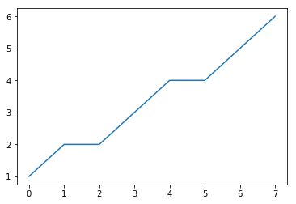

# Hello

### this is the header


```python
data = [1,2,2,3,4,4,5,6]

length = len(data)

data.sort()


print("{}").format(round(sum(data)/float(length),1))

if length % 2 == 1:
    print("{}").format(round(data[length/2],1))
else:
    print("{}").format(round((data[length/2] + data[length/2-1])/2.0,1))
    
unique_vals = [(x,data.count(x)) for x in set(data)]
counts = [x for i,x in unique_vals]

mode = [x[0] for i,x in enumerate(unique_vals) if max(counts) == x[1]]
mode.sort()
print mode[0]

```

    3.4
    3.5
    2


```python
import sys
dir(sys)
print sys.maxint
print sys.maxsize
```

    9223372036854775807
    9223372036854775807


```python
import matplotlib.pyplot as plt
%matplotlib inline
```


```python
plt.plot(data)
```


    [<matplotlib.lines.Line2D at 0x1102feb90>]





```python

```
