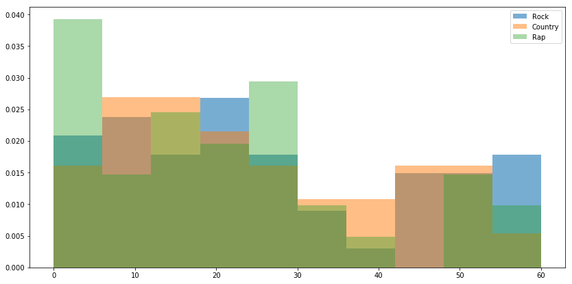

```python
import pandas as pd
import numpy as np
import matplotlib.pyplot as plt
%matplotlib inline
import scipy.stats as stats
```


```python
df = pd.read_csv("assets/billboard.csv")
print df.info()
print df.columns
df.head(10)
```

    <class 'pandas.core.frame.DataFrame'>
    RangeIndex: 317 entries, 0 to 316
    Data columns (total 83 columns):
    year               317 non-null int64
    artist.inverted    317 non-null object
    track              317 non-null object
    time               317 non-null object
    genre              317 non-null object
    date.entered       317 non-null object
    date.peaked        317 non-null object
    x1st.week          317 non-null int64
    x2nd.week          317 non-null object
    x3rd.week          317 non-null object
    x4th.week          317 non-null object
    x5th.week          317 non-null object
    x6th.week          317 non-null object
    x7th.week          317 non-null object
    x8th.week          317 non-null object
    x9th.week          317 non-null object
    x10th.week         317 non-null object
    x11th.week         317 non-null object
    x12th.week         317 non-null object
    x13th.week         317 non-null object
    x14th.week         317 non-null object
    x15th.week         317 non-null object
    x16th.week         317 non-null object
    x17th.week         317 non-null object
    x18th.week         317 non-null object
    x19th.week         317 non-null object
    x20th.week         317 non-null object
    x21st.week         317 non-null object
    x22nd.week         317 non-null object
    x23rd.week         317 non-null object
    x24th.week         317 non-null object
    x25th.week         39 non-null object
    x26th.week         37 non-null object
    x27th.week         30 non-null object
    x28th.week         317 non-null object
    x29th.week         317 non-null object
    x30th.week         317 non-null object
    x31st.week         317 non-null object
    x32nd.week         317 non-null object
    x33rd.week         317 non-null object
    x34th.week         317 non-null object
    x35th.week         317 non-null object
    x36th.week         317 non-null object
    x37th.week         317 non-null object
    x38th.week         317 non-null object
    x39th.week         317 non-null object
    x40th.week         317 non-null object
    x41st.week         317 non-null object
    x42nd.week         317 non-null object
    x43rd.week         317 non-null object
    x44th.week         317 non-null object
    x45th.week         317 non-null object
    x46th.week         317 non-null object
    x47th.week         317 non-null object
    x48th.week         317 non-null object
    x49th.week         317 non-null object
    x50th.week         317 non-null object
    x51st.week         317 non-null object
    x52nd.week         317 non-null object
    x53rd.week         317 non-null object
    x54th.week         317 non-null object
    x55th.week         317 non-null object
    x56th.week         317 non-null object
    x57th.week         317 non-null object
    x58th.week         317 non-null object
    x59th.week         317 non-null object
    x60th.week         317 non-null object
    x61st.week         317 non-null object
    x62nd.week         317 non-null object
    x63rd.week         317 non-null object
    x64th.week         317 non-null object
    x65th.week         317 non-null object
    x66th.week         317 non-null object
    x67th.week         317 non-null object
    x68th.week         317 non-null object
    x69th.week         317 non-null object
    x70th.week         317 non-null object
    x71st.week         317 non-null object
    x72nd.week         317 non-null object
    x73rd.week         317 non-null object
    x74th.week         317 non-null object
    x75th.week         317 non-null object
    x76th.week         317 non-null object
    dtypes: int64(2), object(81)
    memory usage: 205.6+ KB
    None
    Index([u'year', u'artist.inverted', u'track', u'time', u'genre',
           u'date.entered', u'date.peaked', u'x1st.week', u'x2nd.week',
           u'x3rd.week', u'x4th.week', u'x5th.week', u'x6th.week', u'x7th.week',
           u'x8th.week', u'x9th.week', u'x10th.week', u'x11th.week', u'x12th.week',
           u'x13th.week', u'x14th.week', u'x15th.week', u'x16th.week',
           u'x17th.week', u'x18th.week', u'x19th.week', u'x20th.week',
           u'x21st.week', u'x22nd.week', u'x23rd.week', u'x24th.week',
           u'x25th.week', u'x26th.week', u'x27th.week', u'x28th.week',
           u'x29th.week', u'x30th.week', u'x31st.week', u'x32nd.week',
           u'x33rd.week', u'x34th.week', u'x35th.week', u'x36th.week',
           u'x37th.week', u'x38th.week', u'x39th.week', u'x40th.week',
           u'x41st.week', u'x42nd.week', u'x43rd.week', u'x44th.week',
           u'x45th.week', u'x46th.week', u'x47th.week', u'x48th.week',
           u'x49th.week', u'x50th.week', u'x51st.week', u'x52nd.week',
           u'x53rd.week', u'x54th.week', u'x55th.week', u'x56th.week',
           u'x57th.week', u'x58th.week', u'x59th.week', u'x60th.week',
           u'x61st.week', u'x62nd.week', u'x63rd.week', u'x64th.week',
           u'x65th.week', u'x66th.week', u'x67th.week', u'x68th.week',
           u'x69th.week', u'x70th.week', u'x71st.week', u'x72nd.week',
           u'x73rd.week', u'x74th.week', u'x75th.week', u'x76th.week'],
          dtype='object')


<div>
<table border="1" class="dataframe">
  <thead>
    <tr style="text-align: right;">
      <th></th>
      <th>year</th>
      <th>artist.inverted</th>
      <th>track</th>
      <th>time</th>
      <th>genre</th>
      <th>date.entered</th>
      <th>date.peaked</th>
      <th>x1st.week</th>
      <th>x2nd.week</th>
      <th>x3rd.week</th>
      <th>...</th>
      <th>x67th.week</th>
      <th>x68th.week</th>
      <th>x69th.week</th>
      <th>x70th.week</th>
      <th>x71st.week</th>
      <th>x72nd.week</th>
      <th>x73rd.week</th>
      <th>x74th.week</th>
      <th>x75th.week</th>
      <th>x76th.week</th>
    </tr>
  </thead>
  <tbody>
    <tr>
      <th>0</th>
      <td>2000</td>
      <td>Destiny's Child</td>
      <td>Independent Women Part I</td>
      <td>3,38,00 AM</td>
      <td>Rock</td>
      <td>September 23, 2000</td>
      <td>November 18, 2000</td>
      <td>78</td>
      <td>63</td>
      <td>49</td>
      <td>...</td>
      <td>*</td>
      <td>*</td>
      <td>*</td>
      <td>*</td>
      <td>*</td>
      <td>*</td>
      <td>*</td>
      <td>*</td>
      <td>*</td>
      <td>*</td>
    </tr>
    <tr>
      <th>1</th>
      <td>2000</td>
      <td>Santana</td>
      <td>Maria, Maria</td>
      <td>4,18,00 AM</td>
      <td>Rock</td>
      <td>February 12, 2000</td>
      <td>April 8, 2000</td>
      <td>15</td>
      <td>8</td>
      <td>6</td>
      <td>...</td>
      <td>*</td>
      <td>*</td>
      <td>*</td>
      <td>*</td>
      <td>*</td>
      <td>*</td>
      <td>*</td>
      <td>*</td>
      <td>*</td>
      <td>*</td>
    </tr>
    <tr>
      <th>2</th>
      <td>2000</td>
      <td>Savage Garden</td>
      <td>I Knew I Loved You</td>
      <td>4,07,00 AM</td>
      <td>Rock</td>
      <td>October 23, 1999</td>
      <td>January 29, 2000</td>
      <td>71</td>
      <td>48</td>
      <td>43</td>
      <td>...</td>
      <td>*</td>
      <td>*</td>
      <td>*</td>
      <td>*</td>
      <td>*</td>
      <td>*</td>
      <td>*</td>
      <td>*</td>
      <td>*</td>
      <td>*</td>
    </tr>
    <tr>
      <th>3</th>
      <td>2000</td>
      <td>Madonna</td>
      <td>Music</td>
      <td>3,45,00 AM</td>
      <td>Rock</td>
      <td>August 12, 2000</td>
      <td>September 16, 2000</td>
      <td>41</td>
      <td>23</td>
      <td>18</td>
      <td>...</td>
      <td>*</td>
      <td>*</td>
      <td>*</td>
      <td>*</td>
      <td>*</td>
      <td>*</td>
      <td>*</td>
      <td>*</td>
      <td>*</td>
      <td>*</td>
    </tr>
    <tr>
      <th>4</th>
      <td>2000</td>
      <td>Aguilera, Christina</td>
      <td>Come On Over Baby (All I Want Is You)</td>
      <td>3,38,00 AM</td>
      <td>Rock</td>
      <td>August 5, 2000</td>
      <td>October 14, 2000</td>
      <td>57</td>
      <td>47</td>
      <td>45</td>
      <td>...</td>
      <td>*</td>
      <td>*</td>
      <td>*</td>
      <td>*</td>
      <td>*</td>
      <td>*</td>
      <td>*</td>
      <td>*</td>
      <td>*</td>
      <td>*</td>
    </tr>
    <tr>
      <th>5</th>
      <td>2000</td>
      <td>Janet</td>
      <td>Doesn't Really Matter</td>
      <td>4,17,00 AM</td>
      <td>Rock</td>
      <td>June 17, 2000</td>
      <td>August 26, 2000</td>
      <td>59</td>
      <td>52</td>
      <td>43</td>
      <td>...</td>
      <td>*</td>
      <td>*</td>
      <td>*</td>
      <td>*</td>
      <td>*</td>
      <td>*</td>
      <td>*</td>
      <td>*</td>
      <td>*</td>
      <td>*</td>
    </tr>
    <tr>
      <th>6</th>
      <td>2000</td>
      <td>Destiny's Child</td>
      <td>Say My Name</td>
      <td>4,31,00 AM</td>
      <td>Rock'n'roll</td>
      <td>December 25, 1999</td>
      <td>March 18, 2000</td>
      <td>83</td>
      <td>83</td>
      <td>44</td>
      <td>...</td>
      <td>*</td>
      <td>*</td>
      <td>*</td>
      <td>*</td>
      <td>*</td>
      <td>*</td>
      <td>*</td>
      <td>*</td>
      <td>*</td>
      <td>*</td>
    </tr>
    <tr>
      <th>7</th>
      <td>2000</td>
      <td>Iglesias, Enrique</td>
      <td>Be With You</td>
      <td>3,36,00 AM</td>
      <td>Latin</td>
      <td>April 1, 2000</td>
      <td>June 24, 2000</td>
      <td>63</td>
      <td>45</td>
      <td>34</td>
      <td>...</td>
      <td>*</td>
      <td>*</td>
      <td>*</td>
      <td>*</td>
      <td>*</td>
      <td>*</td>
      <td>*</td>
      <td>*</td>
      <td>*</td>
      <td>*</td>
    </tr>
    <tr>
      <th>8</th>
      <td>2000</td>
      <td>Sisqo</td>
      <td>Incomplete</td>
      <td>3,52,00 AM</td>
      <td>Rock'n'roll</td>
      <td>June 24, 2000</td>
      <td>August 12, 2000</td>
      <td>77</td>
      <td>66</td>
      <td>61</td>
      <td>...</td>
      <td>*</td>
      <td>*</td>
      <td>*</td>
      <td>*</td>
      <td>*</td>
      <td>*</td>
      <td>*</td>
      <td>*</td>
      <td>*</td>
      <td>*</td>
    </tr>
    <tr>
      <th>9</th>
      <td>2000</td>
      <td>Lonestar</td>
      <td>Amazed</td>
      <td>4,25,00 AM</td>
      <td>Country</td>
      <td>June 5, 1999</td>
      <td>March 4, 2000</td>
      <td>81</td>
      <td>54</td>
      <td>44</td>
      <td>...</td>
      <td>*</td>
      <td>*</td>
      <td>*</td>
      <td>*</td>
      <td>*</td>
      <td>*</td>
      <td>*</td>
      <td>*</td>
      <td>*</td>
      <td>*</td>
    </tr>
  </tbody>
</table>
<p>10 rows × 83 columns</p>
</div>


### Notes on structure

There are no extra characters to the column names, but can change out the periods to avoid scope jumping bugs.

Most of the data is complete, except for **weeks 25 - 27**.

Most of the **week** columns are "object" cells, though they should contain integer data (or null values!)

It may be better to store all the **week** columns' data in a single column as a list.

The **time** column should probably have a different presentation format for min:sec and no AM/PM

The **date.entered** and **date.peaked** should be dates.

### Check in on the missing data


```python
df.iloc[:,30:35].head().to_html()
```


    u'<table border="1" class="dataframe">\n  <thead>\n    <tr style="text-align: right;">\n      <th></th>\n      <th>x24th.week</th>\n      <th>x25th.week</th>\n      <th>x26th.week</th>\n      <th>x27th.week</th>\n      <th>x28th.week</th>\n    </tr>\n  </thead>\n  <tbody>\n    <tr>\n      <th>0</th>\n      <td>12</td>\n      <td>15</td>\n      <td>22</td>\n      <td>29</td>\n      <td>31</td>\n    </tr>\n    <tr>\n      <th>1</th>\n      <td>36</td>\n      <td>48</td>\n      <td>47</td>\n      <td>NaN</td>\n      <td>*</td>\n    </tr>\n    <tr>\n      <th>2</th>\n      <td>12</td>\n      <td>14</td>\n      <td>17</td>\n      <td>21</td>\n      <td>24</td>\n    </tr>\n    <tr>\n      <th>3</th>\n      <td>44</td>\n      <td>NaN</td>\n      <td>NaN</td>\n      <td>NaN</td>\n      <td>*</td>\n    </tr>\n    <tr>\n      <th>4</th>\n      <td>*</td>\n      <td>NaN</td>\n      <td>NaN</td>\n      <td>NaN</td>\n      <td>*</td>\n    </tr>\n  </tbody>\n</table>'


It turns out the data is rather complete, except that NaN values are not being read as np.NaN values.  I will attempt to make the asterisks into np.NaN values, and cast the data to ints.  

I will first test in the week 24-28 range to make sure all the types of data are handled properly, then apply to all weeks and store in a tuple (I am keeping NaN values to store the week as an index in case some songs drop off the list and return later).

I am also storing the number of positive numbers in the list for a histogram of how long songs stay on the list.


```python
df = df.applymap(lambda x: np.NaN if x=='*' else x)
```


```python
df.info()
```

    <class 'pandas.core.frame.DataFrame'>
    RangeIndex: 317 entries, 0 to 316
    Data columns (total 83 columns):
    year               317 non-null int64
    artist.inverted    317 non-null object
    track              317 non-null object
    time               317 non-null object
    genre              317 non-null object
    date.entered       317 non-null object
    date.peaked        317 non-null object
    x1st.week          317 non-null int64
    x2nd.week          312 non-null object
    x3rd.week          307 non-null object
    x4th.week          300 non-null object
    x5th.week          292 non-null object
    x6th.week          280 non-null object
    x7th.week          269 non-null object
    x8th.week          260 non-null object
    x9th.week          253 non-null object
    x10th.week         244 non-null object
    x11th.week         236 non-null object
    x12th.week         222 non-null object
    x13th.week         210 non-null object
    x14th.week         204 non-null object
    x15th.week         197 non-null object
    x16th.week         182 non-null object
    x17th.week         177 non-null object
    x18th.week         166 non-null object
    x19th.week         156 non-null object
    x20th.week         146 non-null object
    x21st.week         65 non-null object
    x22nd.week         55 non-null object
    x23rd.week         48 non-null object
    x24th.week         46 non-null object
    x25th.week         38 non-null object
    x26th.week         36 non-null object
    x27th.week         29 non-null object
    x28th.week         24 non-null object
    x29th.week         20 non-null object
    x30th.week         20 non-null object
    x31st.week         19 non-null object
    x32nd.week         18 non-null object
    x33rd.week         12 non-null object
    x34th.week         10 non-null object
    x35th.week         9 non-null object
    x36th.week         9 non-null object
    x37th.week         9 non-null object
    x38th.week         8 non-null object
    x39th.week         8 non-null object
    x40th.week         7 non-null object
    x41st.week         7 non-null object
    x42nd.week         6 non-null object
    x43rd.week         6 non-null object
    x44th.week         6 non-null object
    x45th.week         5 non-null object
    x46th.week         5 non-null object
    x47th.week         5 non-null object
    x48th.week         4 non-null object
    x49th.week         4 non-null object
    x50th.week         4 non-null object
    x51st.week         4 non-null object
    x52nd.week         4 non-null object
    x53rd.week         4 non-null object
    x54th.week         2 non-null object
    x55th.week         2 non-null object
    x56th.week         2 non-null object
    x57th.week         2 non-null object
    x58th.week         2 non-null object
    x59th.week         2 non-null object
    x60th.week         2 non-null object
    x61st.week         2 non-null object
    x62nd.week         2 non-null object
    x63rd.week         2 non-null object
    x64th.week         2 non-null object
    x65th.week         1 non-null object
    x66th.week         0 non-null float64
    x67th.week         0 non-null float64
    x68th.week         0 non-null float64
    x69th.week         0 non-null float64
    x70th.week         0 non-null float64
    x71st.week         0 non-null float64
    x72nd.week         0 non-null float64
    x73rd.week         0 non-null float64
    x74th.week         0 non-null float64
    x75th.week         0 non-null float64
    x76th.week         0 non-null float64
    dtypes: float64(11), int64(2), object(70)
    memory usage: 205.6+ KB


### Convert the week columns into a single list
Now that the null values are sorted, I can convert the multiple week columns into a single list (that I can use to make plots!)


```python
print df.iloc[:,30:35].head(10)
df.iloc[:,30:35].apply(lambda x: tuple([int(i) if i==i else -1 for i in x ]), axis=1).head(10)
```

      x24th.week x25th.week x26th.week x27th.week x28th.week
    0         12         15         22         29         31
    1         36         48         47        NaN        NaN
    2         12         14         17         21         24
    3         44        NaN        NaN        NaN        NaN
    4        NaN        NaN        NaN        NaN        NaN
    5         41        NaN        NaN        NaN        NaN
    6         13         14         18         23         23
    7        NaN        NaN        NaN        NaN        NaN
    8         31         32         46        NaN        NaN
    9        NaN        NaN        NaN        NaN        NaN


    0    (12, 15, 22, 29, 31)
    1    (36, 48, 47, -1, -1)
    2    (12, 14, 17, 21, 24)
    3    (44, -1, -1, -1, -1)
    4    (-1, -1, -1, -1, -1)
    5    (41, -1, -1, -1, -1)
    6    (13, 14, 18, 23, 23)
    7    (-1, -1, -1, -1, -1)
    8    (31, 32, 46, -1, -1)
    9    (-1, -1, -1, -1, -1)
    dtype: object


### Testing verified, run on the whole data set
Note that I have changed the null value from -1 to 101 (still off the chart) so that the plots look better


```python
df['week_list'] = df.iloc[:,7:].apply(lambda x: tuple([int(i) if i==i else 101 for i in x ]), axis=1)

```


```python
df['weeks_on_list'] = df['week_list'].apply(lambda x: len([i for i in x if i<101]))
df.head()
```


<div>
<table border="1" class="dataframe">
  <thead>
    <tr style="text-align: right;">
      <th></th>
      <th>year</th>
      <th>artist.inverted</th>
      <th>track</th>
      <th>time</th>
      <th>genre</th>
      <th>date.entered</th>
      <th>date.peaked</th>
      <th>x1st.week</th>
      <th>x2nd.week</th>
      <th>x3rd.week</th>
      <th>...</th>
      <th>x69th.week</th>
      <th>x70th.week</th>
      <th>x71st.week</th>
      <th>x72nd.week</th>
      <th>x73rd.week</th>
      <th>x74th.week</th>
      <th>x75th.week</th>
      <th>x76th.week</th>
      <th>week_list</th>
      <th>weeks_on_list</th>
    </tr>
  </thead>
  <tbody>
    <tr>
      <th>0</th>
      <td>2000</td>
      <td>Destiny's Child</td>
      <td>Independent Women Part I</td>
      <td>3,38,00 AM</td>
      <td>Rock</td>
      <td>September 23, 2000</td>
      <td>November 18, 2000</td>
      <td>78</td>
      <td>63</td>
      <td>49</td>
      <td>...</td>
      <td>NaN</td>
      <td>NaN</td>
      <td>NaN</td>
      <td>NaN</td>
      <td>NaN</td>
      <td>NaN</td>
      <td>NaN</td>
      <td>NaN</td>
      <td>(78, 63, 49, 33, 23, 15, 7, 5, 1, 1, 1, 1, 1, ...</td>
      <td>28</td>
    </tr>
    <tr>
      <th>1</th>
      <td>2000</td>
      <td>Santana</td>
      <td>Maria, Maria</td>
      <td>4,18,00 AM</td>
      <td>Rock</td>
      <td>February 12, 2000</td>
      <td>April 8, 2000</td>
      <td>15</td>
      <td>8</td>
      <td>6</td>
      <td>...</td>
      <td>NaN</td>
      <td>NaN</td>
      <td>NaN</td>
      <td>NaN</td>
      <td>NaN</td>
      <td>NaN</td>
      <td>NaN</td>
      <td>NaN</td>
      <td>(15, 8, 6, 5, 2, 3, 2, 2, 1, 1, 1, 1, 1, 1, 1,...</td>
      <td>26</td>
    </tr>
    <tr>
      <th>2</th>
      <td>2000</td>
      <td>Savage Garden</td>
      <td>I Knew I Loved You</td>
      <td>4,07,00 AM</td>
      <td>Rock</td>
      <td>October 23, 1999</td>
      <td>January 29, 2000</td>
      <td>71</td>
      <td>48</td>
      <td>43</td>
      <td>...</td>
      <td>NaN</td>
      <td>NaN</td>
      <td>NaN</td>
      <td>NaN</td>
      <td>NaN</td>
      <td>NaN</td>
      <td>NaN</td>
      <td>NaN</td>
      <td>(71, 48, 43, 31, 20, 13, 7, 6, 4, 4, 4, 6, 4, ...</td>
      <td>33</td>
    </tr>
    <tr>
      <th>3</th>
      <td>2000</td>
      <td>Madonna</td>
      <td>Music</td>
      <td>3,45,00 AM</td>
      <td>Rock</td>
      <td>August 12, 2000</td>
      <td>September 16, 2000</td>
      <td>41</td>
      <td>23</td>
      <td>18</td>
      <td>...</td>
      <td>NaN</td>
      <td>NaN</td>
      <td>NaN</td>
      <td>NaN</td>
      <td>NaN</td>
      <td>NaN</td>
      <td>NaN</td>
      <td>NaN</td>
      <td>(41, 23, 18, 14, 2, 1, 1, 1, 1, 2, 2, 2, 2, 2,...</td>
      <td>24</td>
    </tr>
    <tr>
      <th>4</th>
      <td>2000</td>
      <td>Aguilera, Christina</td>
      <td>Come On Over Baby (All I Want Is You)</td>
      <td>3,38,00 AM</td>
      <td>Rock</td>
      <td>August 5, 2000</td>
      <td>October 14, 2000</td>
      <td>57</td>
      <td>47</td>
      <td>45</td>
      <td>...</td>
      <td>NaN</td>
      <td>NaN</td>
      <td>NaN</td>
      <td>NaN</td>
      <td>NaN</td>
      <td>NaN</td>
      <td>NaN</td>
      <td>NaN</td>
      <td>(57, 47, 45, 29, 23, 18, 11, 9, 9, 11, 1, 1, 1...</td>
      <td>21</td>
    </tr>
  </tbody>
</table>
<p>5 rows × 85 columns</p>
</div>


### Now we can delete the mass of week columns


```python
df = df.drop(df.columns[8:83], axis=1)
```


```python
df.tail()
```


<div>
<table border="1" class="dataframe">
  <thead>
    <tr style="text-align: right;">
      <th></th>
      <th>year</th>
      <th>artist.inverted</th>
      <th>track</th>
      <th>time</th>
      <th>genre</th>
      <th>date.entered</th>
      <th>date.peaked</th>
      <th>x1st.week</th>
      <th>week_list</th>
      <th>weeks_on_list</th>
    </tr>
  </thead>
  <tbody>
    <tr>
      <th>312</th>
      <td>2000</td>
      <td>Ghostface Killah</td>
      <td>Cherchez LaGhost</td>
      <td>3,04,00 AM</td>
      <td>R &amp; B</td>
      <td>August 5, 2000</td>
      <td>August 5, 2000</td>
      <td>98</td>
      <td>(98, 101, 101, 101, 101, 101, 101, 101, 101, 1...</td>
      <td>1</td>
    </tr>
    <tr>
      <th>313</th>
      <td>2000</td>
      <td>Smith, Will</td>
      <td>Freakin' It</td>
      <td>3,58,00 AM</td>
      <td>Rap</td>
      <td>February 12, 2000</td>
      <td>February 12, 2000</td>
      <td>99</td>
      <td>(99, 99, 99, 99, 101, 101, 101, 101, 101, 101,...</td>
      <td>4</td>
    </tr>
    <tr>
      <th>314</th>
      <td>2000</td>
      <td>Zombie Nation</td>
      <td>Kernkraft 400</td>
      <td>3,30,00 AM</td>
      <td>Rock</td>
      <td>September 2, 2000</td>
      <td>September 2, 2000</td>
      <td>99</td>
      <td>(99, 99, 101, 101, 101, 101, 101, 101, 101, 10...</td>
      <td>2</td>
    </tr>
    <tr>
      <th>315</th>
      <td>2000</td>
      <td>Eastsidaz, The</td>
      <td>Got Beef</td>
      <td>3,58,00 AM</td>
      <td>Rap</td>
      <td>July 1, 2000</td>
      <td>July 1, 2000</td>
      <td>99</td>
      <td>(99, 99, 101, 101, 101, 101, 101, 101, 101, 10...</td>
      <td>2</td>
    </tr>
    <tr>
      <th>316</th>
      <td>2000</td>
      <td>Fragma</td>
      <td>Toca's Miracle</td>
      <td>3,22,00 AM</td>
      <td>R &amp; B</td>
      <td>October 28, 2000</td>
      <td>October 28, 2000</td>
      <td>99</td>
      <td>(99, 101, 101, 101, 101, 101, 101, 101, 101, 1...</td>
      <td>1</td>
    </tr>
  </tbody>
</table>
</div>


```python
df.info()
```

    <class 'pandas.core.frame.DataFrame'>
    RangeIndex: 317 entries, 0 to 316
    Data columns (total 10 columns):
    year               317 non-null int64
    artist.inverted    317 non-null object
    track              317 non-null object
    time               317 non-null object
    genre              317 non-null object
    date.entered       317 non-null object
    date.peaked        317 non-null object
    x1st.week          317 non-null int64
    week_list          317 non-null object
    weeks_on_list      317 non-null int64
    dtypes: int64(3), object(7)
    memory usage: 24.8+ KB


### To convert to dates:
use pd.to_datetime on the series


```python
df['time'] = pd.to_datetime(df['time'], format='%M,%S,00 AM').apply(lambda x: pd.to_timedelta(x - pd.to_datetime('1900-01-01 00:00:00')))
print df['time'].head()
```

    0   00:03:38
    1   00:04:18
    2   00:04:07
    3   00:03:45
    4   00:03:38
    Name: time, dtype: timedelta64[ns]


```python
df['date.entered'] = pd.to_datetime(df['date.entered'])
print df['date.entered'].head()
```

    0   2000-09-23
    1   2000-02-12
    2   1999-10-23
    3   2000-08-12
    4   2000-08-05
    Name: date.entered, dtype: datetime64[ns]


```python
df['date.peaked'] = pd.to_datetime(df['date.peaked'])
print df['date.peaked'].head()
```

    0   2000-11-18
    1   2000-04-08
    2   2000-01-29
    3   2000-09-16
    4   2000-10-14
    Name: date.peaked, dtype: datetime64[ns]


### Sort out how the genres are grouped


```python
df['genre'].value_counts()
```


    Rock           103
    Country         74
    Rap             58
    Rock'n'roll     34
    R&B             13
    R & B           10
    Pop              9
    Latin            9
    Electronica      4
    Gospel           1
    Jazz             1
    Reggae           1
    Name: genre, dtype: int64


```python
df['genre'] = df['genre'].apply(lambda x: 'R & B' if x=='R&B' else x)
```


```python
df['genre'] = df['genre'].apply(lambda x: 'Rock' if x=="Rock'n'roll" else x)
```


```python
df['genre'].value_counts()
```


    Rock           137
    Country         74
    Rap             58
    R & B           23
    Pop              9
    Latin            9
    Electronica      4
    Gospel           1
    Jazz             1
    Reggae           1
    Name: genre, dtype: int64


### Check for duplicated tracks


```python
df[df['track'].duplicated(keep=False)]  # shows the only duplicated track is not a duplicate song
```


<div>
<table border="1" class="dataframe">
  <thead>
    <tr style="text-align: right;">
      <th></th>
      <th>year</th>
      <th>artist.inverted</th>
      <th>track</th>
      <th>time</th>
      <th>genre</th>
      <th>date.entered</th>
      <th>date.peaked</th>
      <th>x1st.week</th>
      <th>week_list</th>
      <th>weeks_on_list</th>
    </tr>
  </thead>
  <tbody>
    <tr>
      <th>118</th>
      <td>2000</td>
      <td>Jones, Donell</td>
      <td>Where I Wanna Be</td>
      <td>00:06:22</td>
      <td>Rock</td>
      <td>2000-04-22</td>
      <td>2000-07-08</td>
      <td>81</td>
      <td>(81, 71, 65, 50, 41, 41, 36, 41, 38, 35, 33, 2...</td>
      <td>20</td>
    </tr>
    <tr>
      <th>305</th>
      <td>2000</td>
      <td>Sheist, Shade</td>
      <td>Where I Wanna Be</td>
      <td>00:04:16</td>
      <td>Rap</td>
      <td>2000-11-11</td>
      <td>2000-11-18</td>
      <td>96</td>
      <td>(96, 95, 99, 99, 100, 101, 101, 101, 101, 101,...</td>
      <td>5</td>
    </tr>
  </tbody>
</table>
</div>


## Does Country music fall off the charts faster than Rock music?

also, make a score for weeks spent in each range:
10pts for 1-9
9 pts for 10-19
8 pts for 20-29
....
1 pt for 90-99

then can get a score for how popular a song was

can plot this vs opening rating and time on charts

### Idea 
Plot things on a proper calendar

each arc will no longer start in same place


```python
def scoring(series):
    """Create a song score based on time spent at each rank in the list"""
    score = 0
    for i in series:
        if i < 10:
            score += 10
        elif i < 20:
            score += 9
        elif i < 30:
            score += 8
        elif i < 40:
            score +=7
        elif i < 50:
            score += 6
        elif i < 60:
            score += 5
        elif i < 70:
            score += 4
        elif i < 80:
            score += 3
        elif i < 90:
            score += 2
        elif i < 100:
            score += 1
    return score
```


```python
df['score'] = df['week_list'].apply(scoring)
```


```python
plt.subplots(figsize=(14,7))
df['weeks_on_list'].hist()
plt.title('Popular songs on the Billboard charts in 2000', fontsize=20)
plt.xticks(fontsize=20)
plt.yticks(fontsize=20)
plt.xlabel("Weeks on chart",fontsize=20)
plt.ylabel("Count",fontsize=20)
```


    <matplotlib.text.Text at 0x111730450>


```python
plt.subplots(figsize=(14,7))
df['score'].hist()
plt.title('Popular songs on the Billboard charts in 2000', fontsize=20)
plt.xticks(fontsize=20)
plt.yticks(fontsize=20)
plt.xlabel("Score",fontsize=20)
plt.ylabel("Count",fontsize=20)
```


    <matplotlib.text.Text at 0x114e2bdd0>


### notes on the graph

- most first enter the chart at around 75th place, but 1 enters at 15th
- study the last position each song holds?
- some peak and fall off quickly, others last longer
- most that don't make top 5 do not stay on chart long

#### look at how different genres behave


```python
plt.subplots(figsize=(14,7))
for i in df['week_list']:
    plt.plot(range(1,len(i)+1),i, '-k', alpha=0.1)
for i in df[(df['x1st.week']<30) & (df['weeks_on_list']<20)]['week_list']:
    plt.plot(range(1,len(i)+1),i, '-r', alpha=0.8)
for i in df[(df['x1st.week']<30) & (df['weeks_on_list']>20)]['week_list']:
    plt.plot(range(1,len(i)+1),i, '-b', alpha=0.8)
plt.title('Popular songs on the Billboard charts in 2000', fontsize=20)
plt.xticks(fontsize=20)
plt.yticks(fontsize=20)
plt.xlabel("Weeks on chart",fontsize=20)
plt.ylabel("Rank",fontsize=20)
plt.xlim(1,70)
plt.ylim(0,100)
plt.plot((0,0),(0,0), '-k',label="Tracks")
plt.plot((0,0),(0,0), '-b',label="Smash Hit")
plt.plot((0,0),(0,0), '-r',label="Fad")
plt.gca().invert_yaxis()
plt.legend()
plt.show()
print "blue, then red rows from database"
pd.concat( [df[(df['x1st.week']<30) & (df['weeks_on_list']>20)] , df[(df['x1st.week']<30) & (df['weeks_on_list']<20)]])
```


    blue, then red rows from database


<div>
<table border="1" class="dataframe">
  <thead>
    <tr style="text-align: right;">
      <th></th>
      <th>year</th>
      <th>artist.inverted</th>
      <th>track</th>
      <th>time</th>
      <th>genre</th>
      <th>date.entered</th>
      <th>date.peaked</th>
      <th>x1st.week</th>
      <th>week_list</th>
      <th>weeks_on_list</th>
      <th>score</th>
    </tr>
  </thead>
  <tbody>
    <tr>
      <th>1</th>
      <td>2000</td>
      <td>Santana</td>
      <td>Maria, Maria</td>
      <td>00:04:18</td>
      <td>Rock</td>
      <td>2000-02-12</td>
      <td>2000-04-08</td>
      <td>15</td>
      <td>(15, 8, 6, 5, 2, 3, 2, 2, 1, 1, 1, 1, 1, 1, 1,...</td>
      <td>26</td>
      <td>242</td>
    </tr>
    <tr>
      <th>45</th>
      <td>2000</td>
      <td>Pink</td>
      <td>There U Go</td>
      <td>00:03:23</td>
      <td>Rock</td>
      <td>2000-03-04</td>
      <td>2000-04-08</td>
      <td>25</td>
      <td>(25, 15, 12, 11, 11, 7, 7, 12, 14, 15, 15, 17,...</td>
      <td>32</td>
      <td>274</td>
    </tr>
    <tr>
      <th>80</th>
      <td>2000</td>
      <td>Hanson</td>
      <td>This Time Around</td>
      <td>00:04:14</td>
      <td>Country</td>
      <td>2000-04-22</td>
      <td>2000-05-06</td>
      <td>22</td>
      <td>(22, 22, 20, 45, 87, 71, 95, 101, 101, 101, 10...</td>
      <td>7</td>
      <td>36</td>
    </tr>
    <tr>
      <th>114</th>
      <td>2000</td>
      <td>Carey, Mariah</td>
      <td>Crybaby</td>
      <td>00:05:19</td>
      <td>Rock</td>
      <td>2000-06-24</td>
      <td>2000-06-24</td>
      <td>28</td>
      <td>(28, 34, 48, 62, 77, 90, 95, 101, 101, 101, 10...</td>
      <td>7</td>
      <td>30</td>
    </tr>
  </tbody>
</table>
</div>


```python
plt.subplots(figsize=(14,7))
for i in df['week_list']:
    plt.plot(range(1,len(i)+1),i, '-k', alpha=0.1)
for i in df[df['weeks_on_list']>53]['week_list']:
    plt.plot(range(1,len(i)+1),i, '-r', alpha=0.8)
for i in df[df['weeks_on_list']==53]['week_list']:
    plt.plot(range(1,len(i)+1),i, '-b', alpha=0.8)
plt.title('Popular songs on the Billboard charts in 2000', fontsize=20)
plt.xticks(fontsize=20)
plt.yticks(fontsize=20)
plt.xlabel("Weeks on chart",fontsize=20)
plt.ylabel("Rank",fontsize=20)
plt.xlim(1,70)
plt.ylim(0,100)
plt.plot((0,0),(0,0), '-k',label="Tracks")
plt.plot((0,0),(0,0), '-b',label="Typical Hit")
plt.plot((0,0),(0,0), '-r',label="Resurgent Hit")
plt.gca().invert_yaxis()
plt.legend()
plt.show()

print "blue, then red rows from database"
pd.concat([df[df['weeks_on_list']==53], df[df['weeks_on_list']>53]])
```


    blue, then red rows from database


<div>
<table border="1" class="dataframe">
  <thead>
    <tr style="text-align: right;">
      <th></th>
      <th>year</th>
      <th>artist.inverted</th>
      <th>track</th>
      <th>time</th>
      <th>genre</th>
      <th>date.entered</th>
      <th>date.peaked</th>
      <th>x1st.week</th>
      <th>week_list</th>
      <th>weeks_on_list</th>
      <th>score</th>
    </tr>
  </thead>
  <tbody>
    <tr>
      <th>17</th>
      <td>2000</td>
      <td>Hill, Faith</td>
      <td>Breathe</td>
      <td>00:04:04</td>
      <td>Rap</td>
      <td>1999-11-06</td>
      <td>2000-04-22</td>
      <td>81</td>
      <td>(81, 68, 62, 51, 42, 35, 28, 28, 28, 43, 30, 2...</td>
      <td>53</td>
      <td>428</td>
    </tr>
    <tr>
      <th>24</th>
      <td>2000</td>
      <td>3 Doors Down</td>
      <td>Kryptonite</td>
      <td>00:03:53</td>
      <td>Rock</td>
      <td>2000-04-08</td>
      <td>2000-11-11</td>
      <td>81</td>
      <td>(81, 70, 68, 67, 66, 57, 54, 53, 51, 51, 51, 5...</td>
      <td>53</td>
      <td>414</td>
    </tr>
    <tr>
      <th>9</th>
      <td>2000</td>
      <td>Lonestar</td>
      <td>Amazed</td>
      <td>00:04:25</td>
      <td>Country</td>
      <td>1999-06-05</td>
      <td>2000-03-04</td>
      <td>81</td>
      <td>(81, 54, 44, 39, 38, 33, 29, 29, 32, 27, 26, 2...</td>
      <td>55</td>
      <td>426</td>
    </tr>
    <tr>
      <th>46</th>
      <td>2000</td>
      <td>Creed</td>
      <td>Higher</td>
      <td>00:05:16</td>
      <td>Rock</td>
      <td>1999-09-11</td>
      <td>2000-07-22</td>
      <td>81</td>
      <td>(81, 77, 73, 63, 61, 58, 56, 52, 56, 57, 57, 5...</td>
      <td>57</td>
      <td>387</td>
    </tr>
  </tbody>
</table>
</div>


```python
plt.subplots(figsize=(14,7))
for i in df[df['genre']=="Rock"]['week_list']:
    plt.plot(range(1,len(i)+1),i, '-b', alpha=0.15)
for i in df[df['genre']=="Country"]['week_list']:
    plt.plot(range(1,len(i)+1),i, '-',color='orange', alpha=0.15)
for i in df[df['genre']=="Rap"]['week_list']:
    plt.plot(range(1,len(i)+1),i, '-g', alpha=0.25)
plt.title('Popular songs on the Billboard charts in 2000', fontsize=20)
plt.xticks(fontsize=20)
plt.yticks(fontsize=20)
plt.xlabel("Weeks on chart",fontsize=20)
plt.ylabel("Rank",fontsize=20)
plt.xlim(1,70)
plt.ylim(0,100)
plt.plot((0,0),(0,0), '-b',label="Rock")
plt.plot((0,0),(0,0), '-',color="orange",label="Country")
plt.plot((0,0),(0,0), '-g',label="Rap")
plt.gca().invert_yaxis()
plt.legend()
plt.show()
```


```python
plt.subplots(figsize=(14,7))
plt.hist(df[df['genre']=="Rock"]['weeks_on_list'],alpha=0.6,normed=True,range=(0,60),label='Rock')
plt.hist(df[df['genre']=="Country"]['weeks_on_list'],alpha=0.5,normed=True,range=(0,60),label='Country')
plt.hist(df[df['genre']=="Rap"]['weeks_on_list'],alpha=0.4,normed=True,range=(0,60),label='Rap')
plt.title('Popular songs on the Billboard charts in 2000', fontsize=20)
plt.xticks(fontsize=20)
plt.yticks(fontsize=20)
plt.xlabel("Weeks on Chart",fontsize=20)
plt.ylabel("Frequency",fontsize=20)
plt.legend()
plt.show()
```


```python
plt.subplots(figsize=(14,7))
counter = 0
plots=[]
for i in df.genre.unique():
    plots.append(df[df['genre']==i]['weeks_on_list'])
    counter += 1
#plots.
plt.boxplot(plots)
plt.xticks(range(1,df.genre.nunique()+1),df.genre.unique(), rotation=90, fontsize=20)
plt.yticks( fontsize=20)
plt.title("Weeks on List Distribution by Genre", fontsize=20)
plt.show()
```


```python
plt.subplots(figsize=(14,7))
plt.hist(df[df['genre']=="Rock"]['score'],alpha=0.6,normed=True,range=(0,60),label='Rock')
plt.hist(df[df['genre']=="Country"]['score'],alpha=0.5,normed=True,range=(0,60),label='Country')
plt.hist(df[df['genre']=="Rap"]['score'],alpha=0.4,normed=True,range=(0,60),label='Rap')
plt.legend()
plt.show()
```





```python
plt.subplots(figsize=(14,7))
counter = 0
plots=[]
for i in df.genre.unique():
    plots.append(df[df['genre']==i]['score'])
    counter += 1
#plots.
plt.boxplot(plots)
plt.xticks(range(1,df.genre.nunique()+1),df.genre.unique(), rotation=90, fontsize=20)
plt.yticks( fontsize=20)
plt.title("Song Score Distribution by Genre", fontsize=20)
plt.show()
```


```python
tstat1, pval1 = stats.ttest_ind(a= df[df['genre']=='Rock']['score'],
                b= df[df['genre']=='Country']['score'],
                equal_var=False)
```


```python
tstat2, pval2 = stats.ttest_ind(a= df[df['genre']=='Rock']['weeks_on_list'],
                b= df[df['genre']=='Country']['weeks_on_list'],
                equal_var=False)
```

### Hypothesis test results

Running a hypothesis test:
I want to test the theory that Rock songs perform better on the charts than Country songs.  I broke this down into two independent hypothesis tests which I will run with $\alpha$ = 5%.

Since they are one tailed tests (i.e. Rock songs spend **more** time on the charts), I need to be sure to collect my p-values into only single tail probabilities (i.e. multiply them by 2).  Alternatively, I can compute a critical value for t based on my $\alpha$ and degrees of freedom to compare with the test statistic returned by the t-test algorithm.


```python
alpha = 0.05
print "Do Pop songs get a higher score than Country songs?"
print pval1*2 < alpha
print "Do Pop songs stay on the charts longer than Country songs?"
print 2 * pval2 < alpha
```

    Do Pop songs get a higher score than Country songs?
    True
    Do Pop songs stay on the charts longer than Country songs?
    False


```python
df.head().to_html()
```


    u'<table border="1" class="dataframe">\n  <thead>\n    <tr style="text-align: right;">\n      <th></th>\n      <th>year</th>\n      <th>artist.inverted</th>\n      <th>track</th>\n      <th>time</th>\n      <th>genre</th>\n      <th>date.entered</th>\n      <th>date.peaked</th>\n      <th>x1st.week</th>\n      <th>week_list</th>\n      <th>weeks_on_list</th>\n      <th>score</th>\n    </tr>\n  </thead>\n  <tbody>\n    <tr>\n      <th>0</th>\n      <td>2000</td>\n      <td>Destiny\'s Child</td>\n      <td>Independent Women Part I</td>\n      <td>00:03:38</td>\n      <td>Rock</td>\n      <td>2000-09-23</td>\n      <td>2000-11-18</td>\n      <td>78</td>\n      <td>(78, 63, 49, 33, 23, 15, 7, 5, 1, 1, 1, 1, 1, ...</td>\n      <td>28</td>\n      <td>247</td>\n    </tr>\n    <tr>\n      <th>1</th>\n      <td>2000</td>\n      <td>Santana</td>\n      <td>Maria, Maria</td>\n      <td>00:04:18</td>\n      <td>Rock</td>\n      <td>2000-02-12</td>\n      <td>2000-04-08</td>\n      <td>15</td>\n      <td>(15, 8, 6, 5, 2, 3, 2, 2, 1, 1, 1, 1, 1, 1, 1,...</td>\n      <td>26</td>\n      <td>242</td>\n    </tr>\n    <tr>\n      <th>2</th>\n      <td>2000</td>\n      <td>Savage Garden</td>\n      <td>I Knew I Loved You</td>\n      <td>00:04:07</td>\n      <td>Rock</td>\n      <td>1999-10-23</td>\n      <td>2000-01-29</td>\n      <td>71</td>\n      <td>(71, 48, 43, 31, 20, 13, 7, 6, 4, 4, 4, 6, 4, ...</td>\n      <td>33</td>\n      <td>285</td>\n    </tr>\n    <tr>\n      <th>3</th>\n      <td>2000</td>\n      <td>Madonna</td>\n      <td>Music</td>\n      <td>00:03:45</td>\n      <td>Rock</td>\n      <td>2000-08-12</td>\n      <td>2000-09-16</td>\n      <td>41</td>\n      <td>(41, 23, 18, 14, 2, 1, 1, 1, 1, 2, 2, 2, 2, 2,...</td>\n      <td>24</td>\n      <td>216</td>\n    </tr>\n    <tr>\n      <th>4</th>\n      <td>2000</td>\n      <td>Aguilera, Christina</td>\n      <td>Come On Over Baby (All I Want Is You)</td>\n      <td>00:03:38</td>\n      <td>Rock</td>\n      <td>2000-08-05</td>\n      <td>2000-10-14</td>\n      <td>57</td>\n      <td>(57, 47, 45, 29, 23, 18, 11, 9, 9, 11, 1, 1, 1...</td>\n      <td>21</td>\n      <td>177</td>\n    </tr>\n  </tbody>\n</table>'


```python

```
